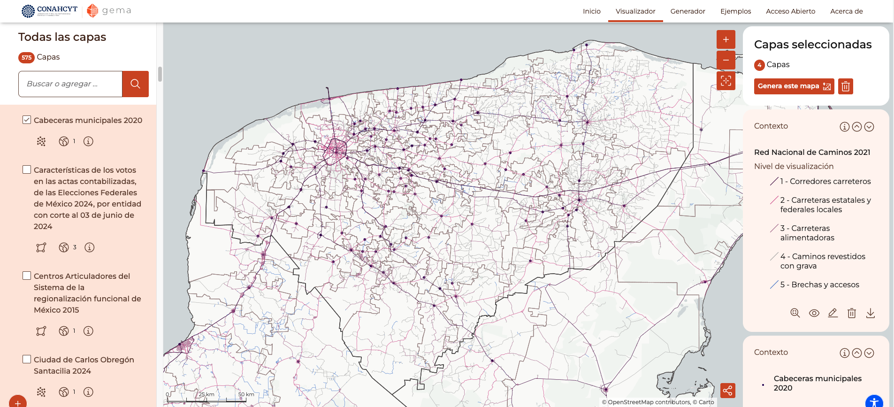

```{r setup, include=FALSE}
knitr::opts_chunk$set(echo = TRUE)

pacman::p_load(dplyr, sf, stringr, ggplot2, leaflet, leaflet.extras2, rmapshaper)
data_original = file.path(".", "data_original")
data_procesada = file.path(".", "data_procesada")
```

## Movilidad

Datos de movilidad del 2021 origen-destino. Los datos cuentan con el municipio o ageb de origen (source) y destino (target), así como el número de dispositivos detectados (w) que se desplazaron en diferentes horas del día (0, 6, 10, 14, 17 y 21 horas).

Para este estudio se agruparon los datos acumulados del noviembre y diciembre de 2021 del estado de Yucatán. Para ello se generaron las siguientes funciones.

```{r Funciones para agrupar datos de movilidad, include=TRUE}
#' Filtro de movimiento interno
#'
#' Filtra los dispositivos que se movieron dentro de Yucatán.
#'
#' @param DataFreme de movilidad del que se filtrarán los datos.
#' 
#' @returns DataFrame de movilidad filtrado.
#' @export
#'
#' @examples
#' # Ejemplo de filtrado
#' filtro_yucatan_interno(df)
acumular_movilidad <- function(df1, df2) {
  return(bind_rows(df1, df2) %>%
    group_by(source, target) %>%
    summarise(w = sum(w, na.rm = TRUE), .groups = "drop"))
}

#' Estructuración de archivos de movilidad
#'
#' - Lee un archivos de movilidad, asegurandose que las claves geográficas sean leídas correctamente, en string y con el número adecuado de carácteres de acuerdo al tipo, municipio o ageb.
#' - Acumula los que pertenezcan al estado de Yucatán y sean de noviembre y diciembre de 2021.
#' - Guarda los acumulados en archivos en csv
#' - Devuelve las estadíasticas obtenidas en cada lectura
#'
#' @param tipo ["municipio", "ageb"] tipo de archivos a leer.
#' 
#' @returns DataFrame de estadísticas obtenidas.
#' @export
#'
#' @examples
#' # Ejemplo de estructuración de archivos de ageb
#' acumulados_yucatan(tipo = "ageb")
acumulados_yucatan <- function(tipo = "municipio") {
  # archivos disponibles de movilidad
  archivos <- list.files(
    path = file.path(data_original, paste0("movilidad_", tipo)),
    pattern = "*.csv", full.names = TRUE)
  # archivos que sean de noviembre y diciembre
  archivos <- archivos[grepl("_2021_11|_2021_12", archivos)]
  
  estadisticas <- data.frame()
  internos_acumulado <- data.frame()
  llegadas_acumulado <- data.frame()
  salidas_acumulado <- data.frame()
  
  for(archivo in archivos) {
    width_pad_cve <- ifelse(tipo == "municipio", 5, 13)
    df <- read.csv(archivo) %>%
      mutate(# asegurar los caracteres adecuados con ceros a la izquierda
        source = str_pad(as.character(source), width = width_pad_cve, pad = "0", side = "left"),
        target = str_pad(as.character(target), width = width_pad_cve, pad = "0", side = "left"))
    
    # Filtra los que solo se movinron dentro de Yucatán
    internos <- df |> filter(startsWith(source, "31") & startsWith(target, "31"))
    internos_acumulado <- acumular_movilidad(internos_acumulado, internos)
    
    # Filtra los que vienen de otros estados y llegaron a Yucatán
    llegadas <- df |> filter(!startsWith(source, "31") & startsWith(target, "31"))
    llegadas_acumulado <- acumular_movilidad(llegadas_acumulado, llegadas)
    
    # Filtra los que son de Yucatán de origen y salieron a otros estados
    salidas <- df |> filter(startsWith(source, "31") & !startsWith(target, "31"))
    salidas_acumulado <- acumular_movilidad(salidas_acumulado, salidas)
    
    # Guardar estadísticas
    estadisticas <- rbind(estadisticas, data.frame(
      archivo = tail(strsplit(archivo, "/")[[1]], 1), total = sum(df$w), total_filas = nrow(df),
      internos = sum(internos$w), internos_acumulado = sum(internos_acumulado$w),
      internos_filas = nrow(internos), internos_filas_acumulado = nrow(internos_acumulado),
      llegadas = nrow(llegadas), llegadas_acumulado = nrow(llegadas_acumulado),
      salidas = nrow(salidas), salidas_acumulado = nrow(salidas_acumulado)
    ))
  }
  
  write.csv(internos_acumulado, file.path(data_procesada, paste0(tipo, "-interno.csv")), row.names = FALSE)
  write.csv(llegadas_acumulado, file.path(data_procesada, paste0(tipo, "-llegadas.csv")), row.names = FALSE)
  write.csv(salidas_acumulado, file.path(data_procesada, paste0(tipo, "-salidas.csv")), row.names = FALSE)
  write.csv(estadisticas, file.path(data_procesada, paste0(tipo, "-estadisticas.csv")), row.names = FALSE)
  
  return(estadisticas)
}
```

```{r Acumulados por municipio, eval=FALSE}
estadisticas_mun <- acumulados_yucatan()
summary(estadisticas_mun)
```

```{r Acumulados por ageb, eval=FALSE}
estadisticas_ageb <- acumulados_yucatan(tipo = "ageb")
summary(estadisticas_ageb)
```


## Marco Geoestadístico Nacional

Información del Marco Geoestadístico Nacional de diciembre del 2021 que se podría utilizar.

|Archivo|Nombre|Útil|
|:-|:--------------------|:-:|
|31**a**  |Áreas Geoestadísticas Básicas Urbanas|✅|
|31**ar** |Áreas Geoestadísticas Básicas Rurales|✅|
|31**ent**|Áreas Geoestadísticas Estatales|✅|
|31**mun**|Áreas Geoestadísticas Municipales|✅|
|31**cd** |Caserío Disperso|❌|
|31**e**  |Ejes de vialidad (segmentos de vialidad cuya dimensión es variable)|✅|
|31**fm** |Frentes de manzanas|❌|
|31**lpr**|Localidades Puntuales Rurales|✅|
|31**l**  |Localidades Urbanas y Rurales Amanzanadas|✅|
|31**pe** |Polígonos Externos (delimitan el área de una localidad rural que contiene caserío disperso y servicios fuera de ésta)|❌|
|31**pem**|Polígonos Externos de Manzanas (contiene el caserío disperso en la periferia de localidades urbanas)|❌|
|31**m**  |Polígonos de manzanas|❌|
|31**sia**|Servicios con Información complementaria de tipo Área (áreas verdes, camellones, glorietas)|❌|
|31**sil**|Servicios con Información complementaria de tipo Línea (ríos, ferrocarriles, corrientes de agua)|❌|
|31**sip**|Servicios con Información complementaria de tipo Puntual|❌|
|31**ti** |Territorio Insular|❌|

Preprocesamiento de archivos para guardarlos en la proyección correcta: 32616.

```{r lectura de archivos MGN}
trasnformat_mgn <- function(archivo, nombre) {
  capa <- st_transform(
    st_read(
      file.path(data_original, "mgn", paste0("31", archivo, ".shp")),
      options = "ENCODING=WINDOWS-1252"),
    crs = 32616)
  
  st_write(
    capa,
    file.path(data_procesada, paste0(nombre, ".gpkg")),
    layer = nombre,
    delete_layer = TRUE)
  
  return(capa)
}
```

```{r Almacenamiento de archivos del MGN, eval=FALSE}
trasnformat_mgn('a', 'agebs_urbanas')
trasnformat_mgn('ar', 'agebs_rurales')
trasnformat_mgn('mun', 'municipios')
trasnformat_mgn('e', 'segmentos_vialidad')
trasnformat_mgn('lpr', 'localidades_rurales')
trasnformat_mgn('l', 'localidades_urbanas_y_rurales_amanzanadas')
```


## Gema

[Gema](https://gema.conahcyt.mx/visualizador?capas=gref_red_nacional_caminos_21_nal_l,,1;gref_cabeceras_municipales_20_loc_p,,1;gref_division_estatal_20_est_a,,1;gref_division_municipal_21_mun_a,,1#map=9/20.6035/-88.4996) contienen datos estructurados y preprocesados en un servidor de mapas (Geoserver) que podrían servir para este análisis, como la Red Nacional de Caminos 2021 y las Cabeceras municipales 2020.



Para obtener estos datos solo del estado de Yucatán, se puede filtrar por clave geográfica o por polígono, para ello primero se debe obtener el poligono de interés.

Extracción del poligono más grande del estado de Yucatán para aplicar filtros a Gema.

```{r Obtención del poligono máyor de Yucatán}
entidad = trasnformat_mgn('ent', 'entidad')
poligonos <- st_cast(st_transform(entidad, crs = 4326), "POLYGON")
poligono_mayor <- poligonos[which.max(st_area(poligonos)), ]$geometry
poligono_mayor <- ms_simplify(poligono_mayor, keep = 0.05, keep_shapes = TRUE)
plot(poligono_mayor)

bbox <- as.numeric(st_bbox(poligono_mayor))
print(bbox)
```

Visualización de las capas de gema filtradas por clave geográfica o por polígono:

```{r Visualización de las capas de gema filtradas}
url_gema = "https://gema.conahcyt.mx/geoserver/ows"

leaflet(
  # st_transform(municipios, crs = 4326)
) %>%
  # setView(lng = -89.5, lat = 20.75, zoom = 7.5) %>%
  fitBounds(lng1 = bbox[1], lat1 = bbox[2], lng2 = bbox[3], lat2 = bbox[4]) %>%
  setMaxBounds(lng1 = bbox[1], lat1 = bbox[2], lng2 = bbox[3], lat2 = bbox[4]) %>%
  # addTiles() %>%
  # addPolygons(color = "green", weight = 1, fillOpacity = 0) %>%
  leaflet.extras2::addWMS(
    baseUrl = url_gema,
    layers = "gref_division_estatal_20_est_a",
    options = WMSTileOptions(
      format = "image/png",
      transparent = TRUE,
      CQL_FILTER = "cve_ent='31'"
    )
  ) %>%
  leaflet.extras2::addWMS(
    baseUrl = url_gema,
    layers = "gref_division_municipal_21_mun_a",
    options = WMSTileOptions(
      format = "image/png",
      transparent = TRUE,
      CQL_FILTER = "cve_ent='31'"
    )
  ) %>%
  leaflet.extras2::addWMS(
    baseUrl = url_gema,
    layers = "gref_cabeceras_municipales_20_loc_p",
    options = WMSTileOptions(
      format = "image/png",
      transparent = TRUE,
      CQL_FILTER = "cve_ent='31'"
    )
  ) %>%
  leaflet.extras2::addWMS(
    baseUrl = url_gema,
    layers = "gref_red_nacional_caminos_21_nal_l",
    options = WMSTileOptions(
      format = "image/png",
      transparent = TRUE,
      CQL_FILTER = paste0("INTERSECTS(geom,",
        st_as_text(poligono_mayor)
        # gsub(" ", "", st_as_text(st_as_sfc(st_bbox(poligono_mayor))))
        # st_as_text(st_as_sfc(st_bbox(poligono_mayor)))
      ,") AND escala_vis<=3")
    )
  )
```

Extracción de fetures de las capas de Gema

```{r Extracción de capas de Gema}
preparar_gema <- function(parametros, nombre) {
  parametros <- c(list(
    service = 'WFS',
    request = 'GetFeature',
    version = '2.0.0',
    outputFormat = 'application/json'
  ), parametros)
  
  url <- paste0(url_gema, "?",
    paste(names(parametros), parametros, sep = "=", collapse = "&"))
  
  capa <- st_transform(st_read(url), crs = 32616)
  st_write(
    capa,
    file.path(data_procesada, paste0(nombre, ".gpkg")),
    layer = nombre,
    delete_layer = TRUE)
  
  return(capa)
}

preparar_gema(list(
  typeName = "gref_cabeceras_municipales_20_loc_p",
  CQL_FILTER = "cve_ent='31'"
), "cabeceras_municipales")

preparar_gema(list(
  typeName = "gref_red_nacional_caminos_21_nal_l",
  bbox = paste(c(bbox, 'EPSG:4326'), collapse = ",")
), "red_caminos")
```

